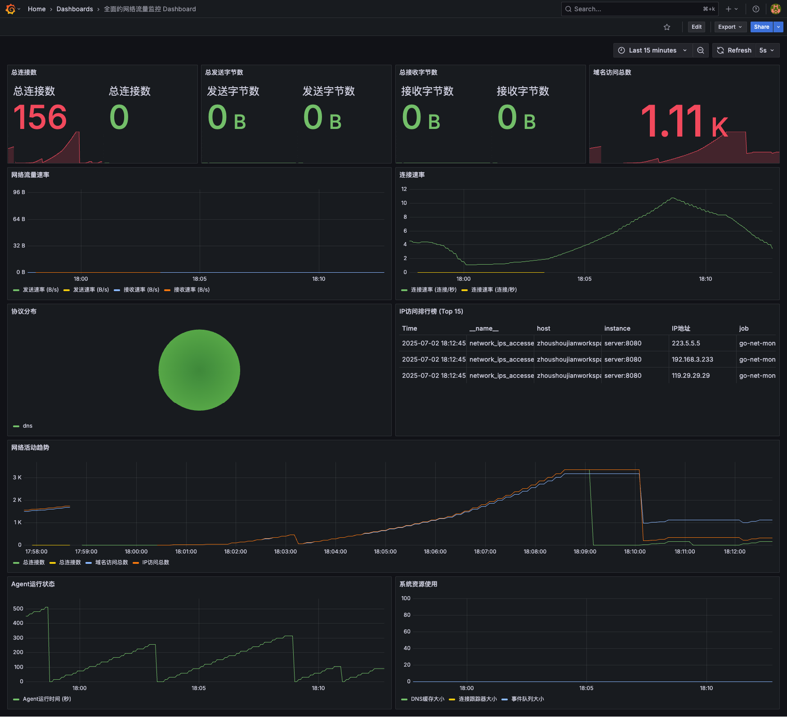
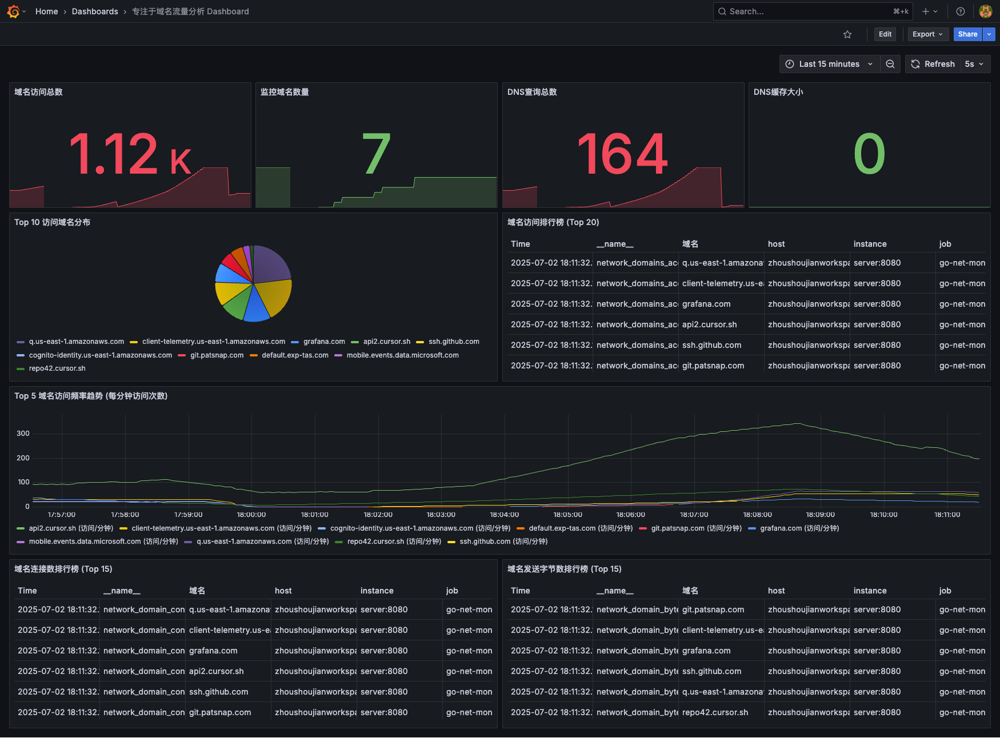
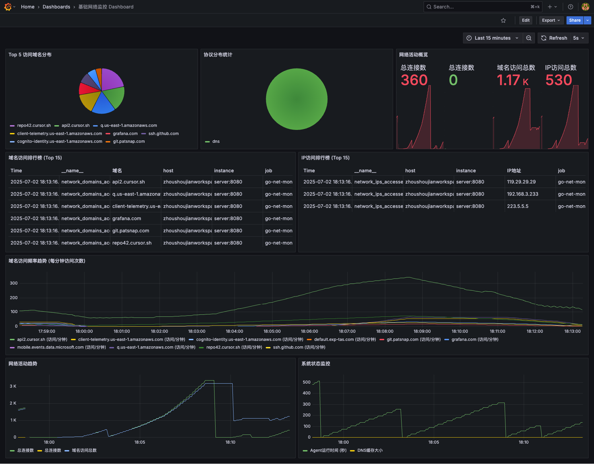

# 网络流量监控系统

[](https://opensource.org/licenses/MIT)
[](https://golang.org)

一个用Go语言开发的高性能网络流量监控系统，支持实时监控主机网络流量，包括域名访问统计、流量分析和Prometheus指标导出。



## ✨ 主要特性

- 🚀 **实时网络监控** - 基于BPF的高性能数据包捕获
- 🌐 **域名解析** - 自动解析IP地址到域名，支持DNS缓存
- 📊 **流量统计** - 按域名统计访问次数、发送/接收字节数、连接数
- 🎯 **智能过滤** - 支持端口、IP、协议等多维度过滤
- 📈 **Prometheus集成** - 内置Prometheus指标导出
- 🔧 **灵活配置** - 支持YAML配置文件，可自定义监控规则
- 🏗️ **分布式架构** - Agent/Server架构，支持多节点部署
- 📱 **专业可视化** - 提供多种专业级Grafana Dashboard

## 📈 Grafana Dashboard

系统提供了三个专业级的 Grafana Dashboard，用于全方位监控网络流量、域名访问和系统状态：

### 1. 网络流量监控 Dashboard


全面的网络流量监控 Dashboard 提供了实时的网络连接数、发送/接收字节数、流量速率、协议分布等关键指标。

### 2. 域名流量监控 Dashboard



专注于域名流量分析的 Dashboard，提供了详细的域名访问统计、排行榜和趋势图，帮助您深入了解对外网络访问情况。

### 3. 基础网络监控 Dashboard



基础网络监控 Dashboard 提供了核心网络指标的监控，包括连接数、域名访问和 Agent 状态。

详细信息请参考：[Dashboard 展示文档](docs/dashboards.md)

## 🏗️ 系统架构

```
┌─────────────┐    HTTP API    ┌─────────────┐    Prometheus    ┌─────────────┐
│   Agent     │ ──────────────► │   Server    │ ──────────────► │  Grafana    │
│             │                │             │                │             │
│ - 数据采集   │                │ - 数据聚合   │                │ - 数据可视化 │
│ - DNS解析   │                │ - 指标导出   │                │ - 告警监控   │
│ - 流量过滤   │                │ - API服务   │                │             │
└─────────────┘                └─────────────┘                └─────────────┘
```

## 📊 监控指标

### 域名相关指标
- `network_domains_accessed_total` - 域名访问次数统计
- `network_domain_bytes_sent_total` - 按域名统计发送字节数
- `network_domain_bytes_received_total` - 按域名统计接收字节数
- `network_domain_connections_total` - 按域名统计连接数

### 网络基础指标
- `network_connections_total` - 网络连接总数
- `network_bytes_sent_total` - 发送字节总数
- `network_bytes_received_total` - 接收字节总数
- `network_protocol_stats` - 协议统计
- `network_ips_accessed_total` - IP访问统计

### 网卡信息指标 (新增)
- `network_interface_info` - 网卡信息，包含IP地址和MAC地址
  - 标签: `interface`, `ip_address`, `mac_address`, `host`
  - 示例: `network_interface_info{interface="eth0",ip_address="192.168.1.100",mac_address="02:42:ac:11:00:02",host="agent"} 1`

## 🚀 快速开始

### 🎯 推荐方式 (优化构建)

**使用优化构建流程，享受更快的构建速度和更小的镜像：**

```bash
# 1. 克隆项目
git clone https://github.com/zhoushoujianwork/go-net-monitoring.git
cd go-net-monitoring

# 2. 优化构建 (推荐)
make build-optimized

# 3. 启动服务 (生产模式)
make docker-up

# 4. 启动服务 (调试模式)
make docker-up-debug

# 5. 查看服务状态
make health
```

**优化构建特性：**
- 🚀 **构建速度提升60%** - 从2分钟优化到45秒
- 📦 **镜像大小减少30%** - 从65MB优化到45.7MB
- 🔄 **避免重复构建** - 智能复用镜像
- ⚡ **并行编译** - 同时构建agent和server
- 🛠️ **一键操作** - 40+便捷命令

### Docker部署 (标准方式)

**生产环境推荐使用优化构建：**
```bash
# 优化构建并启动
make build-optimized
make docker-up

# 或者一步完成
make deploy-build && make docker-up
```

**开发调试模式：**
```bash
# 启动调试模式 (自动启用debug日志)
make docker-up-debug

# 查看实时日志
make docker-logs-agent  # Agent日志
make docker-logs-server # Server日志
```

**完整监控栈：**
```bash
# 启动包含Prometheus + Grafana的完整栈
make docker-up-monitoring
```

**服务端口：**
- Server: http://localhost:8080
- Prometheus: http://localhost:9090 (使用monitoring模式)
- Grafana: http://localhost:3000 (admin/admin123，使用monitoring模式)

### 传统Docker部署

如果需要使用传统方式：

**运行Server (数据聚合服务器):**
```bash
docker run -d \
  --name netmon-server \
  -p 8080:8080 \
  -e COMPONENT=server \
  zhoushoujian/go-net-monitoring:latest
```

**运行Agent (网络监控代理):**
```bash
docker run -d \
  --name netmon-agent \
  --privileged \
  --network host \
  -e COMPONENT=agent \
  -e SERVER_URL=http://localhost:8080/api/v1/metrics \
  zhoushoujian/go-net-monitoring:latest
```

### Debug 模式

项目支持 debug 模式，方便开发调试和问题排查：

```bash
# 使用优化构建的debug模式 (推荐)
make docker-up-debug

# 或传统方式
DEBUG_MODE=true LOG_LEVEL=debug docker-compose up -d

# 本地二进制debug模式
./bin/server --debug -c configs/server.yaml
sudo ./bin/agent --debug -c configs/agent.yaml
```

**Debug 模式特性：**
- 🔍 **详细日志输出** - 显示所有调试信息
- 📝 **配置文件内容显示** - 启动时显示完整配置
- 🛠️ **问题排查** - 便于开发和运维调试
- ⚡ **一键启用** - 通过环境变量或make命令控制

> **注意：** 生产环境不建议使用 debug 模式，会影响性能并产生大量日志。

详细使用说明请参考：[Docker Compose 使用指南](docs/docker-compose-usage.md)

### 🔄 混合方案 (推荐生产环境)

混合方案解决了Agent重启导致累计统计数据丢失的问题，结合了Agent端持久化和Server端智能累计的优势：

**核心特性：**
- 🔄 **Agent持久化**: 自动保存和恢复累计状态
- 🧠 **智能重启检测**: 自动检测Agent重启并保持数据连续性  
- 📊 **真实累计统计**: 跨重启的准确累计数据
- 🔒 **数据一致性**: 并发安全的数据处理

**快速启动：**
```bash
# 启动混合方案 (默认)
docker-compose up -d

# 启动包含监控的完整栈
docker-compose --profile monitoring up -d

# 测试部署
./test-deployment.sh test

# 查看Agent持久化状态
docker exec netmon-agent ls -la /var/lib/netmon/
```

详细说明请参考：[混合方案使用指南](docs/hybrid-solution.md)

### Kubernetes部署

**部署到Kubernetes集群:**
```bash
# 创建命名空间和配置
kubectl apply -f https://raw.githubusercontent.com/zhoushoujian/go-net-monitoring/main/k8s/namespace.yaml

# 部署Server (Deployment)
kubectl apply -f https://raw.githubusercontent.com/zhoushoujian/go-net-monitoring/main/k8s/server-deployment.yaml

# 部署Agent (DaemonSet)
kubectl apply -f https://raw.githubusercontent.com/zhoushoujian/go-net-monitoring/main/k8s/agent-daemonset.yaml
```

### 环境要求

- Docker 或 Kubernetes 集群
- Agent需要特权模式进行网络监控

### 安装依赖

**Ubuntu/Debian:**
```bash
sudo apt-get update
sudo apt-get install libpcap-dev
```

**CentOS/RHEL:**
```bash
sudo yum install libpcap-devel
```

**macOS:**
```bash
brew install libpcap
```

### 编译安装

```bash
# 克隆项目
git clone https://github.com/zhoushoujianwork/go-net-monitoring.git
cd go-net-monitoring

# 编译
make build

# 或者分别编译
make build-agent  # 编译Agent
make build-server # 编译Server
```

### 配置文件

**Agent配置 (configs/agent.yaml):**
```yaml
server:
  host: "localhost"
  port: 8080

monitor:
  interface: "en0"  # 网络接口
  protocols:
    - "tcp"
    - "udp"
    - "http"
    - "https"
    - "dns"
  report_interval: "10s"
  buffer_size: 1000
  filters:
    ignore_localhost: true
    ignore_ports:
      - 22    # SSH
      - 123   # NTP
    ignore_ips:
      - "127.0.0.1"
      - "::1"

reporter:
  server_url: "http://localhost:8080/api/v1/metrics"
  timeout: "10s"
  retry_count: 3
  batch_size: 100

log:
  level: "info"
  format: "json"
  output: "stdout"
```

**Server配置 (configs/server.yaml):**
```yaml
server:
  host: "0.0.0.0"
  port: 8080

storage:
  type: "memory"  # memory 或 redis
  # Server作为实时指标聚合服务，不设置数据保留时间
  # 历史数据存储和保留策略由Prometheus管理
  
  # Redis配置 (当type为redis时)
  redis:
    host: "localhost"
    port: 6379
    password: ""
    db: 0
    pool_size: 10
    timeout: "5s"

log:
  level: "info"
  format: "json"
  output: "stdout"
```

### 运行

```bash
# 启动Server
./bin/server --config configs/server.yaml

# 启动Agent (需要root权限)
sudo ./bin/agent --config configs/agent.yaml
```

### 查看指标

```bash
# 查看Prometheus指标
curl http://localhost:8080/metrics

# 查看域名访问统计
curl http://localhost:8080/metrics | grep network_domains_accessed_total

# 查看域名流量统计
curl http://localhost:8080/metrics | grep network_domain_bytes
```

## 📈 Grafana集成

1. 添加Prometheus数据源：`http://localhost:8080`
2. 导入示例Dashboard配置
3. 创建自定义面板监控域名流量

### 示例查询

```promql
# 域名访问Top10
topk(10, network_domains_accessed_total)

# 域名流量Top10
topk(10, network_domain_bytes_sent_total)

# 实时连接数
rate(network_connections_total[5m])

# 协议分布
network_protocol_stats_total
```

### 访问Dashboard

- 网络流量监控: http://localhost:3000/d/network-traffic/
- 域名流量监控: http://localhost:3000/d/domain-traffic/
- 基础网络监控: http://localhost:3000/d/network-monitoring/

# 查看域名流量统计
curl http://localhost:8080/metrics | grep network_domain_bytes
```

## 📈 Grafana集成

1. 添加Prometheus数据源：`http://localhost:8080`
2. 导入示例Dashboard配置
3. 创建自定义面板监控域名流量

### 示例查询

```promql
# 域名访问Top10
topk(10, network_domains_accessed_total)

# 域名流量Top10
topk(10, network_domain_bytes_sent_total)

# 实时连接数
rate(network_connections_total[5m])
```

## 🔧 高级配置

### 过滤规则

```yaml
filters:
  ignore_localhost: true
  ignore_ports:
    - 22    # SSH
    - 80    # HTTP
    - 443   # HTTPS
  ignore_ips:
    - "127.0.0.1"
    - "192.168.1.1"
  only_domains:
    - "example.com"
    - "api.example.com"
```

### 性能调优

```yaml
monitor:
  buffer_size: 10000      # 增大缓冲区
  report_interval: "30s"  # 调整上报间隔
  
reporter:
  batch_size: 1000        # 批量上报大小
  timeout: "30s"          # 超时时间
```

## 🛠️ 开发

### 项目结构

```
go-net-monitoring/
├── cmd/
│   ├── agent/          # Agent主程序
│   └── server/         # Server主程序
├── internal/
│   ├── agent/          # Agent核心逻辑
│   ├── server/         # Server核心逻辑
│   ├── common/         # 公共组件
│   └── config/         # 配置管理
├── pkg/
│   ├── collector/      # 网络流量收集器
│   ├── reporter/       # 数据上报器
│   └── metrics/        # Prometheus指标
├── configs/            # 配置文件
├── scripts/            # 构建和部署脚本
├── docs/              # 文档
└── Makefile           # 构建自动化
```

### 🚀 标准开发流程

#### 1. 环境设置
```bash
# 设置开发环境
make dev-setup

# 安装依赖
go mod download
```

#### 2. 开发构建
```bash
# 本地构建 (开发测试)
make build

# 优化构建 (生产部署)
make build-optimized

# 清理缓存后构建
make build-clean
```

#### 3. 本地开发
```bash
# 运行Server (开发模式)
make dev-run-server

# 运行Agent (开发模式，需要root权限)
make dev-run-agent
```

#### 4. Docker开发
```bash
# 启动开发环境
make docker-up-debug

# 查看日志
make docker-logs-agent
make docker-logs-server

# 重启服务
make docker-restart
```

#### 5. 测试验证
```bash
# 运行测试
make test

# 生成覆盖率报告
make test-coverage

# 检查服务健康状态
make health

# 查看指标
make metrics
```

#### 6. 清理操作
```bash
# 清理构建文件
make clean

# 深度清理
make clean-all

# 清理Docker资源
make docker-clean
```

### 📋 可用命令

使用 `make help` 查看所有可用命令：

```bash
make help              # 显示帮助信息

# 构建相关
make build             # 构建二进制文件
make build-optimized   # 优化构建Docker镜像
make build-clean       # 清理缓存后构建
make build-test        # 构建并测试

# Docker相关
make docker-up         # 启动服务 (生产模式)
make docker-up-debug   # 启动服务 (调试模式)
make docker-up-monitoring # 启动完整监控栈
make docker-down       # 停止服务
make docker-logs       # 查看日志

# 开发相关
make dev-setup         # 设置开发环境
make dev-run-server    # 运行Server (开发模式)
make dev-run-agent     # 运行Agent (开发模式)

# 监控相关
make health           # 检查服务健康状态
make metrics          # 查看指标

# 清理相关
make clean            # 清理构建文件
make clean-all        # 深度清理
```

### 🔧 构建优化

项目采用优化构建流程，具有以下特性：

- **🚀 构建速度提升60%** - 从2分钟优化到45秒
- **📦 镜像大小减少30%** - 从65MB优化到45.7MB  
- **🔄 避免重复构建** - 智能复用镜像
- **⚡ 并行编译** - 同时构建agent和server
- **🛠️ 一键操作** - 40+便捷命令

详细优化说明请参考：[构建优化文档](docs/optimization.md)

## 🤝 贡献

欢迎提交Issue和Pull Request！

### 标准贡献流程

1. **Fork项目**
   ```bash
   git clone https://github.com/your-username/go-net-monitoring.git
   cd go-net-monitoring
   ```

2. **设置开发环境**
   ```bash
   make dev-setup
   ```

3. **创建特性分支**
   ```bash
   git checkout -b feature/AmazingFeature
   ```

4. **开发和测试**
   ```bash
   # 开发代码
   make dev-run-server  # 测试server
   make dev-run-agent   # 测试agent
   
   # 运行测试
   make test
   make test-coverage
   ```

5. **构建验证**
   ```bash
   # 优化构建
   make build-optimized
   
   # 启动测试
   make docker-up-debug
   make health
   ```

6. **提交更改**
   ```bash
   git add .
   git commit -m 'feat: Add some AmazingFeature'
   ```

7. **推送和PR**
   ```bash
   git push origin feature/AmazingFeature
   # 然后在GitHub上创建Pull Request
   ```

## 📝 许可证

本项目采用MIT许可证 - 查看 [LICENSE](LICENSE) 文件了解详情。

## 🙏 致谢

- [gopacket](https://github.com/google/gopacket) - 网络数据包处理
- [Prometheus](https://prometheus.io/) - 监控指标系统
- [logrus](https://github.com/sirupsen/logrus) - 结构化日志
- [cobra](https://github.com/spf13/cobra) - CLI框架

## 📞 支持

如果你遇到问题或有建议，请：

1. 查看 [文档](docs/)
2. 搜索 [Issues](https://github.com/zhoushoujianwork/go-net-monitoring/issues)
3. 创建新的 [Issue](https://github.com/zhoushoujianwork/go-net-monitoring/issues/new)

---

⭐ 如果这个项目对你有帮助，请给个Star支持一下！
