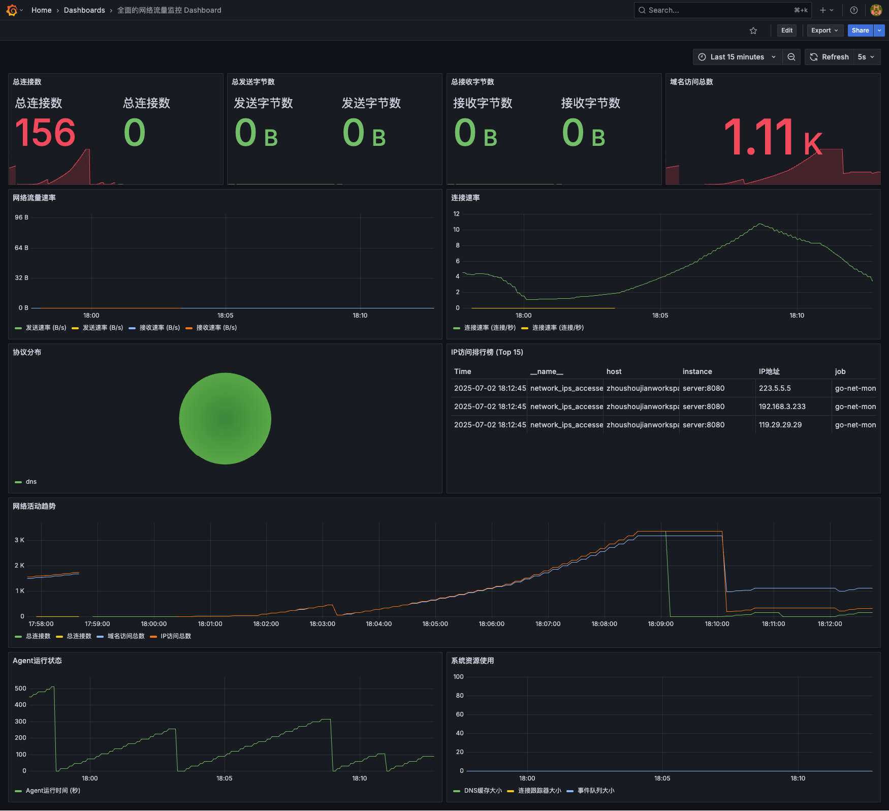
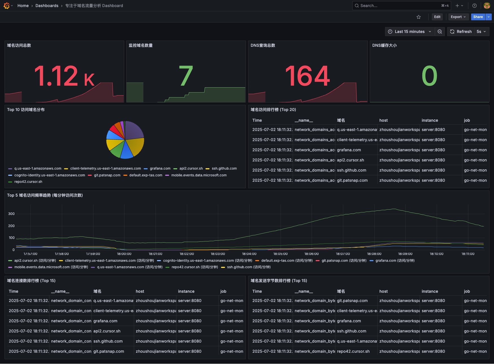
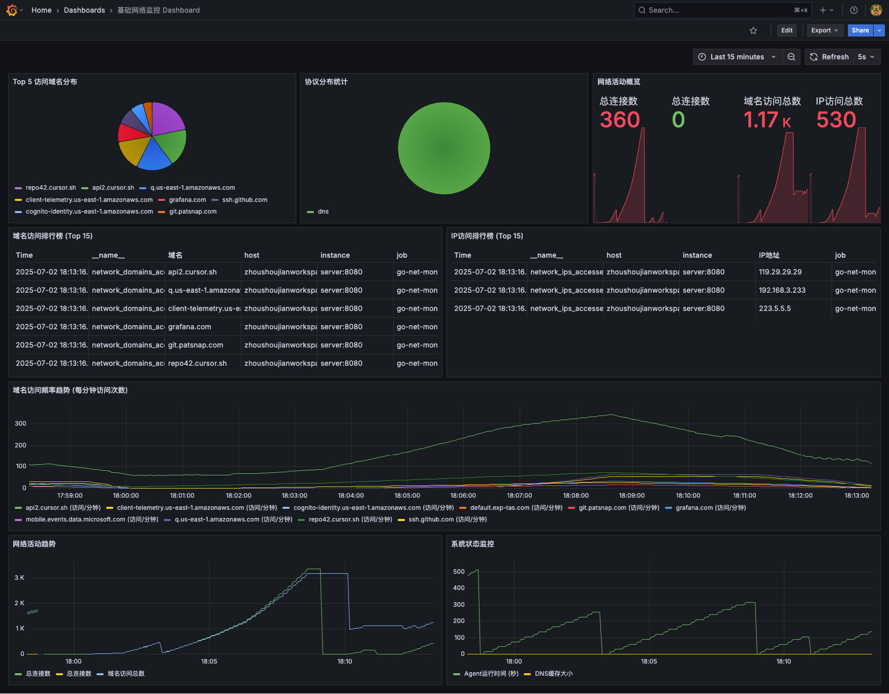

# 网络监控 Dashboard 展示

本项目提供了三个专业级的 Grafana Dashboard，用于全方位监控网络流量、域名访问和系统状态。

## 1. 网络流量监控 Dashboard

全面的网络流量监控 Dashboard 提供了实时的网络连接数、发送/接收字节数、流量速率、协议分布等关键指标，帮助您全面了解网络活动。

**主要功能：**

- 实时监控网络连接数、发送/接收字节数
- 网络流量速率图表
- 协议分布饼图
- IP 访问排行榜
- 系统资源使用情况

## 2. 域名流量监控 Dashboard

专注于域名流量分析的 Dashboard，提供了详细的域名访问统计、排行榜和趋势图，帮助您深入了解对外网络访问情况。

**主要功能：**

- 域名访问总数统计
- Top 10 访问域名分布
- 域名访问排行榜
- 域名访问频率趋势
- 域名连接数排行榜
- 域名发送字节数排行榜

## 3. 基础网络监控 Dashboard

基础网络监控 Dashboard 提供了核心网络指标的监控，包括连接数、域名访问和 Agent 状态。

**主要功能：**

- 基础网络监控指标
- 域名访问统计
- Agent 状态监控

## 使用方法

所有 Dashboard 都可以通过 Grafana 界面访问：

1. 访问 Grafana: http://localhost:3000
2. 使用默认凭据登录：
   - 用户名: admin
   - 密码: admin123
3. 从左侧菜单选择 "Dashboards"，然后选择您想要查看的 Dashboard

## 自定义 Dashboard

您可以根据自己的需求自定义这些 Dashboard：

1. 在 Grafana 界面中打开 Dashboard
2. 点击右上角的 "Save" 按钮旁边的下拉菜单
3. 选择 "Save as" 创建自己的副本
4. 根据需要添加、修改或删除面板

## 技术细节

这些 Dashboard 使用 Prometheus 作为数据源，展示了以下关键指标：

- `network_connections_total` - 网络连接总数
- `network_bytes_sent_total` - 发送字节总数
- `network_bytes_received_total` - 接收字节总数
- `network_domains_accessed_total` - 域名访问次数
- `network_domain_connections_total` - 域名连接数
- `network_domain_bytes_sent_total` - 发送到域名的字节数
- `network_domain_bytes_received_total` - 从域名接收的字节数
- `network_protocol_stats_total` - 协议统计
- `network_ips_accessed_total` - IP 访问统计
- `agent_uptime_seconds` - Agent 运行时间
- `dns_cache_size` - DNS 缓存大小

所有 Dashboard 都设置了 5 秒自动刷新，可以实时观察网络活动！
